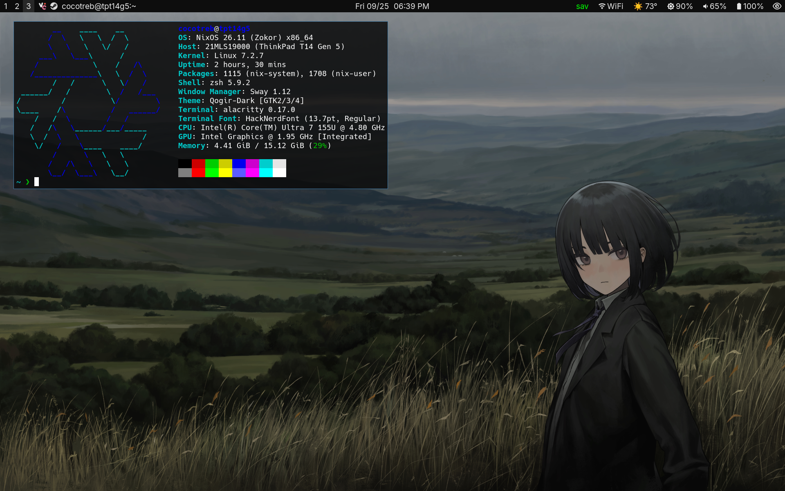

# Daily Driver Dotfiles
My NixOS dotfiles for both gaming and development. Uses [Qogir](https://github.com/vinceliuice/Qogir-theme) GTK theme. Very functional while meeting a minimum aesthetic threshold, for me at least. Window manager is SwayWM with my own opinionated keybinds. This config is also ported to non-NixOS distros.

**If you want to use these:**
- Remember to edit the wallpaper paths in swaylock and the swaywm config as you will get errors if you don't update them yourself.
- The "config" folder has the files in .config required for both NixOS and non-NixOS (I was too lazy to port them to home manager :P)
- There will be LOTs of breaking changes, I don't recommend you to daily these but you could use them as a starting point.

**List of stuff that is imperatively added:**
- Kicad libraries
- PCSX2 games and saves
- Steam compatibility tools added with protonup-rs
- Settings and profiles in Helium

**Notable keybind additions/changes:**
- Reloading the config is `Mod+Shift+R`
- Selecting parent containers is `Mod+I`, and `Mod+O` for child containers
- `Mod+U` focuses the most recent urgent window
- `Mod+C` moves floating windows to the center of the workspace
- `Mod+N` brings up the SwayNC control panel, `Mod+M` toggles the waybar

## Screenshot

## See also

[Current wallpaper](https://wallhaven.cc/w/qrgqyq) (Modified to fit my resolution and got rid of the rainbow with GIMP)

[tdelamater1's dotfiles](https://github.com/tdelamater1/dots/tree/master) (thx for the weather waybar module)

**Old wallpaper links**

[Anime girl w/ whiskey](https://wallhaven.cc/w/r2qqlj)

[Moraine lake](https://4kwallpapers.com/nature/moraine-lake-landscape-sunrise-mountains-54.html)

[Moonrise rolling](https://4kwallpapers.com/nature/moonrise-rolling-25877.html)

[Megurine Luka](https://wallpaper-a-day.com/2016/06/24/) (remember to click on "1440p version")

[Hatsune Miku](https://wallpaper-a-day.com/2025/12/11/22411/#respond)

